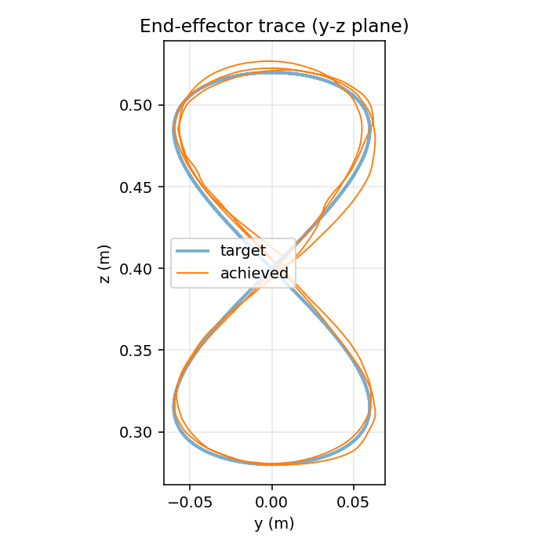
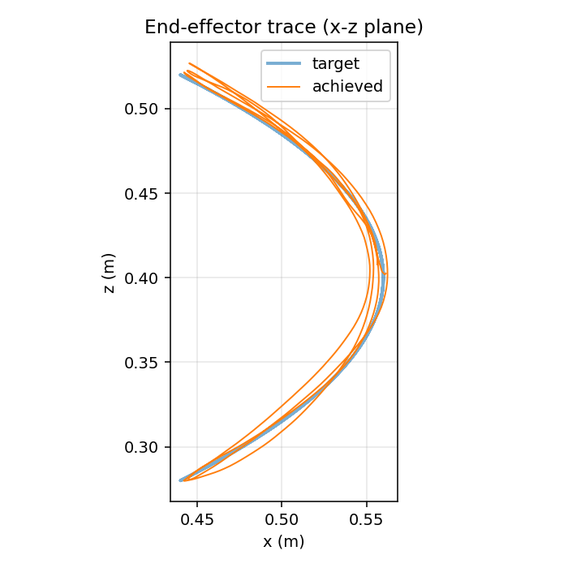
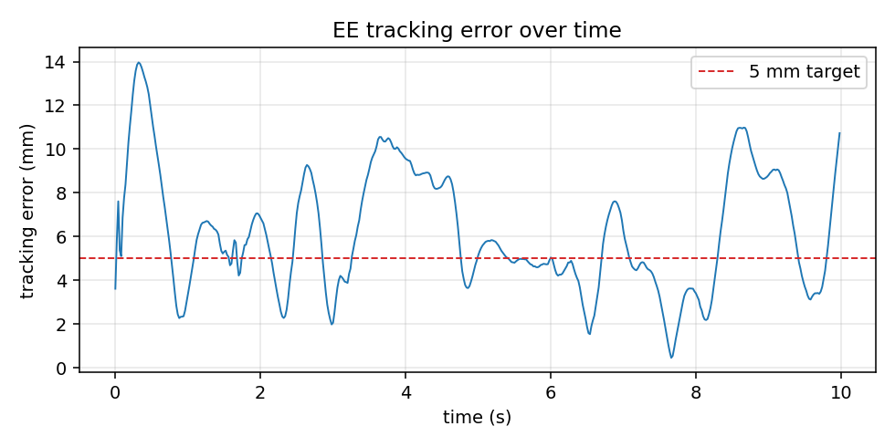

# Kinesis

[](https://github.com/Harrishayy/Kinesis/actions/workflows/ci.yml)
[](LICENSE)
[](https://www.python.org/)

End-effector trajectory tracking for the **Franka Emika Panda** in MuJoCo, learned with PPO under observation noise and control delay (two uncertainties).

The headline result is **residual RL on top of a damped-least-squares Jacobian-pseudoinverse IK feedforward**: the policy never has to re-learn kinematics, it learns a residual that compensates for delay, noise, and dynamics. On a Viviani curve (a 3-D figure-eight on a sphere), the residual policy reaches **6.43 mm steady-state RMS, 10.98 mm max** under σ = 2 cm observation noise + 2-step (40 ms) control delay, beating every end-to-end variant on the same curve at the same compute budget, and dropping action jerk ~4× across the board.

## Evidence

The `viviani_residual` policy tracking its native curve under the training-distribution noise and delay. Deterministic best-by-eval rollout, 3 trajectory periods, 50 Hz control. Reproducible via `make eval` on a fresh clone using the committed checkpoint.

**Tracking plots**

<table>
    <tr>
      <td align="center"><br><sub>YZ projection: target (blue) vs achieved TCP (orange) in the curve's primary plane</sub></td>
      <td align="center"><br><sub>XZ projection: depth dimension; both axes engaged, no degenerate planar reduction</sub></td>
    </tr>
    <tr>
      <td colspan="2" align="center"><br><sub>L2 tracking error across 3 trajectory periods. Steady-state (after t&gt;1 s settle window): RMS 6.43 mm, max 10.98 mm</sub></td>
    </tr>
</table>

**Multi-view rollout videos** (GitHub renders these inline when viewing this README on github.com; otherwise the files are at `results/viviani_residual/videos/`)

<table>
    <tr>
      <td align="center"><video src="results/viviani_residual/videos/rollout_side.mp4" controls width="430"></video><br><sub>Side view (default eval render)</sub></td>
      <td align="center"><video src="results/viviani_residual/videos/rollout_front.mp4" controls width="430"></video><br><sub>Front view</sub></td>
    </tr>
    <tr>
      <td align="center"><video src="results/viviani_residual/videos/rollout_top.mp4" controls width="430"></video><br><sub>Top view (curve viewed along world −z)</sub></td>
      <td align="center"><video src="results/viviani_residual/videos/rollout_bottom.mp4" controls width="430"></video><br><sub>Bottom view (curve viewed along world +z, through the table)</sub></td>
    </tr>
</table>

Full numbers (end-to-end vs residual, native vs zero-shot, white vs pink noise) in [`RESULTS.md`](RESULTS.md).

---

## Quickstart

**Prerequisites:** Python 3.11, [uv](https://docs.astral.sh/uv/) for env management, and `git` (the Panda assets come in as a submodule via `mujoco_menagerie`). The full setup is local-only: training runs on CPU, no GPU or cluster required.

```bash
git clone https://github.com/Harrishayy/Kinesis.git
cd Kinesis
make setup       # creates .venv (Python 3.11), `uv pip install -e .[dev]`, pulls the
                 # mujoco_menagerie submodule, installs pre-commit. ~2 min first time.
make test        # runs the pytest suite (29 tests, ~0.5 s). Confirms env + wrappers
                 # + trajectories + factory all import and behave correctly.
```

**Run the headline experiment (residual RL on Viviani, ~25 min on an M-series Mac):**

```bash
# 1. Train. Streams PPO scalars to stdout and writes TensorBoard events:
#       logs/tb/viviani_residual/PPO_<n>/   <- scalar curves
#    Checkpoints written every 200k steps to:
#       checkpoints/viviani_residual/                                      <- intermediates
#       checkpoints/viviani_residual/best/best_model.zip                   <- best by eval
#       checkpoints/viviani_residual/ppo_panda_final.zip                   <- final step
uv run python scripts/train.py --config viviani_residual

# 2. Evaluate. Loads ppo_panda_final.zip by default, runs a deterministic rollout
#    for 3 trajectory periods, computes RMS/max/jerk, and writes:
#       results/viviani_residual/plots/{yz_trace,xz_trace,error_vs_time}.png
#       results/viviani_residual/videos/rollout.mp4                        <- side view
uv run python scripts/eval.py --config viviani_residual
```

You don't actually need to retrain to reproduce the headline numbers: the `viviani_residual` checkpoints (`best/best_model.zip` and `ppo_panda_final.zip`) are committed to this repo (`~4 MB`), so `uv run python scripts/eval.py --config viviani_residual` works on a fresh clone.

**Other entry points:**

```bash
make eval                                           # reproduces the headline 6.43 mm RMS on a fresh clone (~10 s,
                                                    # uses committed viviani_residual best/best_model.zip)
make train                                          # end-to-end PPO on the circle baseline, ~7 min CPU
                                                    # (a fast smoke that the training loop works at all)
make train-fig8 / make eval-fig8                    # 3D figure-8 variant
uv run python scripts/tools/plot_curves.py --traj viviani_residual
                                                    # offline learning curve PNG from TB events
uv run python scripts/tools/ablate.py --config viviani_residual
                                                    # robustness ablation table -> results/<traj>/ablation.md
uv run python scripts/tools/render_views.py --config viviani_residual
                                                    # multi-view rollout (front/side/top/bottom) MP4s
```

**Configs.** `--config <name>` accepts either:

- A **bare name** like `circle`, `viviani`, `viviani_residual`. The factory resolver (`src/kinesis/envs/factory.py:load_config`) recursively searches `src/kinesis/configs/{naive,residual}/` and matches `<name>.yaml`. Available configs:

| `naive/` (end-to-end PPO) | `residual/` (PPO residual on IK feedforward) |
| --- | --- |
| `circle`, `figure8_3d`, `viviani` | `circle_residual`, `figure8_3d_residual` |
| `viviani_v2`, `viviani_slow`, `viviani_4m` | `viviani_residual`, `viviani_residual_pink` |

- An **explicit path**, e.g. `--config path/to/my_custom.yaml`. Useful for sweeps; copy a YAML out of `src/kinesis/configs/`, change weights, point `--config` at the copy.

**Live TensorBoard during training:**

```bash
tensorboard --logdir logs/tb/        # open the printed URL; key scalars:
                                     #   rollout/ep_rew_mean
                                     #   rollout/ee_error_rms_m   (this is the one to watch)
                                     #   eval/mean_reward
```

## Viewing the simulation

Three options, in order of usefulness for a reviewer skimming the submission:

```bash
# 1. Play the saved deterministic-policy video (no setup beyond `make setup`).
open results/viviani_residual/videos/rollout.mp4

# 2. Open the robot model in MuJoCo's interactive viewer with no policy.
#    Drag joints around, verify the URDF/assets resolved correctly.
uv run python -m mujoco.viewer --mjcf=assets/mujoco_menagerie/franka_emika_panda/scene.xml

# 3. Run the trained policy live in a draggable viewer (best demo).
#    `make play` handles the macOS DYLD_LIBRARY_PATH gymnastics; see below.
make play ARGS="--config viviani_residual"
make play ARGS="--config viviani_residual --no-wrappers"     # clean view, no noise/delay
make play ARGS="--config viviani_residual --realtime"        # throttle to wall-clock
make play ARGS="--config circle --checkpoint checkpoints/circle/best/best_model.zip"
```

> *macOS only:* `make play` invokes the `mjpython` trampoline required by MuJoCo's `launch_passive`, with `DYLD_LIBRARY_PATH` derived from the venv's Python at invocation time (so any 3.11.x patch works). On Linux you can call `uv run python scripts/play.py` directly. If you hit a `dyld` error, check the Makefile; `DYLD_LIBRARY_PATH` is overridable on the command line.

## Where to look for more

Per-trajectory artifacts for every variant cited in `RESULTS.md` live under `results/<name>/{plots,videos}/`. Regenerate any of them with `uv run python scripts/eval.py --config <name>`; add `--no-video` to skip the MP4 render. A multi-view render (front / side / top / bottom) of the same deterministic rollout is one command away: `uv run python scripts/tools/render_views.py --config <name>`.

## Project structure

```
.
├── src/kinesis/
│   ├── envs/                # PandaTrackEnv + wrappers + config-driven factory
│   ├── trajectories/        # one module per trajectory (circle, viviani, figure8_3d, ...)
│   └── configs/
│       ├── naive/           # end-to-end PPO configs
│       └── residual/        # residual RL on top of the analytic IK feedforward
├── scripts/
│   ├── train.py / eval.py / play.py   # user-facing entrypoints
│   └── tools/               # ablate, plot_curves, render_views, find_home_pose
├── tests/                   # pytest suite
├── assets/                  # vendored mujoco_menagerie Panda assets (submodule)
└── results/<name>/
    ├── plots/               # yz_trace, xz_trace, error_vs_time, learning_curve
    ├── videos/              # rollout (side / front / top / bottom)
    └── ablation.md          # robustness ablations (where applicable)
```

## Design note

### State (observation)

The policy sees a fixed-size vector of robot proprioception plus the upcoming trajectory:

```
[ q (7), q̇ (7), ee_pos (3), target_now (3), target_lookahead (3 × N),
  phase_sin_cos (2), prev_action (7) ]
```

Two design calls worth flagging:

1. **Lookahead targets.** Instead of giving the policy only `target(t)`, we expose `target(t), target(t+Δ), target(t+2Δ), ..., target(t+NΔ)`. With observation noise + control delay, a policy that only sees "where I should be right now" is forced to differentiate noisy positions to estimate velocity. Handing it a short window of upcoming targets means it can read velocity and curvature directly from the obs. This is what lets the residual policy stay robust under σ = 2 cm noise without needing a learned filter (`viviani_v2` lookahead extension 0.4 s → 1.2 s is one of the documented experiments in `RESULTS.md`).
2. **Phase sin/cos, not raw `t`.** The trajectory is periodic, so the policy should treat `t = 0` and `t = T` identically. Encoding phase as `(sin 2π t/T, cos 2π t/T)` makes the wrap-around continuous and is the standard trick from periodic-control RL.

### Action

Joint position deltas (Δq ∈ ℝ⁷), clipped to ±5° per step at 50 Hz control. We deliberately avoided two more "elegant" choices:

- **Torque control** would have given the policy fine-grained authority but turned every reward sweep into a stability hunt. Position-delta control delegates the inner loop to MuJoCo's PD controllers, which is what real Pandas use anyway.
- **End-effector Cartesian deltas + analytic IK at every step** would have looked clean, but Cartesian targets near singularities silently produce huge joint moves. Letting the policy command joints directly keeps the action space well-conditioned everywhere in the workspace.

For residual configs, the policy output is *added* to a damped-least-squares Jacobian-pseudoinverse IK action, and the sum is clipped to ±1:

```
a_total = clip( a_feedforward(q, target, target_vel) + a_residual(obs), ±1 )
```

The feedforward solves position + orientation IK using only `(q, target, target_vel)`, so the residual carries the dynamics, delay, and noise compensation. This decomposition gave us the biggest single improvement in the project (best naive: 8.40 mm RMS; with residual: 6.43 mm on a harder curve, and 4× lower jerk).

### Reward

Weighted sum, intentionally short:

```
r =  - w_track * ||ee - target||²
     - w_action_rate * ||a_t - a_{t-1}||²
     - w_qdot * ||q̇||²
     + w_inband * 1[||ee - target|| < ε]
     - w_orient * (1 - cos θ)            # residual configs only
```

The first term is the only one that *teaches* tracking; the rest are smoothness/shaping. We deliberately started with `w_track` and `w_action_rate` alone, then added `w_qdot` once we saw the policy chattering through configurations with high joint velocity but low tip motion, and finally added the in-band shaping bonus to break a plateau where the policy hovered ~3 cm from the target indefinitely. The orientation term only matters for residual configs, which solve for hand-z pointing down: in pure-position end-to-end runs, the policy just ignored orientation and that was fine.

The reward is normalised to per-step values (no episode-summing), so PPO's advantage estimator sees the right scale at every transition. All weights are in the trajectory's YAML so reward tuning is a config edit, not a code edit.

### Trajectory representation

Each trajectory is a class with a single contract:

```python
def target(self, t: float) -> tuple[np.ndarray, np.ndarray]:
    """Return (position_world_xyz, velocity_world_xyz) at phase t."""
```

The policy is stateless with respect to *which* trajectory it's tracking, it only ever sees `target_now` and the lookahead window. Three concrete curves are implemented:

- `circle` -- 15 cm radius in the y-z plane, 0.25 Hz. Engages mainly elbow + wrist. Used as the smoke-test baseline.
- `figure8_3d` -- tilted 3-D Lissajous. Forces shoulder/base joints to participate.
- `viviani` -- intersection of a sphere with a tangent cylinder, a figure-eight on a sphere. Deliberately harder than the circle (the policy can't park its base) and is the headline test curve.

Because the policy interface depends only on `target_now + lookahead`, the same `viviani_residual` checkpoint zero-shots onto the circle and the figure-8 at eval time (see `RESULTS.md §2`).

### Evaluation methodology

All numbers in `RESULTS.md` come from the same protocol:

1. **Deterministic best-checkpoint rollout.** PPO trains stochastically, but we evaluate the best-by-validation checkpoint with the action distribution's mean (not a sample). Two reasons: a single training run has stochastic seeds, but the *policy you'd deploy* is the deterministic one; and removing the rollout's exploration noise isolates tracking quality from exploration variance.
2. **Same env as training, including wrappers.** Evaluation runs with σ = 2 cm observation noise + 2-step (40 ms) control delay. We don't strip the wrappers for eval, because the brief explicitly asks for behaviour under uncertainty, not best-case nominal tracking.
3. **Three metrics, three concerns.**
   - **Steady-state RMS** of the tip-to-target L2 distance, dropping the first half-period (the policy starts at an IK-fitted home pose, so there's a transient settling we don't want to dominate the number). RMS captures average tracking quality.
   - **Steady-state max** captures worst-case excursion, which for a manipulator is often what matters more than the average -- a 6 mm RMS that occasionally spikes to 5 cm is much worse than a steady 8 mm.
   - **Time-RMS jerk** (`d³ee/dt³` of the recorded TCP trace, finite-differenced at the control rate). This is what makes the difference between "the arm follows the curve" and "the arm follows the curve smoothly enough to put a glass of water on the gripper". Jerk is the single best proxy for whether the policy is using actuation cleanly or fighting noise.
4. **Same episode length, same period count.** 500 steps = 10 s = 2.5 periods of the curve. Comparing variants under different episode lengths would confound "policy is better" with "policy got more periods to converge", so this is held fixed across configs.

The reasoning behind reporting all three is that any single metric is gameable. A policy can achieve excellent RMS by being very slightly biased toward an "average" position and never moving (low RMS, terrible max). A policy can achieve excellent max by aggressively snapping to targets every step (good max, awful jerk, broken hardware). Reporting RMS + max + jerk together makes it hard to optimise a number without optimising the underlying behaviour.

### Why this decomposition matters for the role

The analytic-feedforward + learned-residual structure used here is the same decomposition increasingly used in sim-to-real humanoid control: the feedforward carries everything that is model-based (kinematics, gravity compensation, contact handling) and the residual carries the dynamics and disturbances that are hard to model. Keeping the residual small is what makes domain randomization tractable on real hardware, because the policy is only ever asked to learn a small correction on top of a behaviour that is already approximately correct. A 7-DoF arm tracking a Cartesian curve is a small testbed for that decomposition; the contribution here is empirical (does the structure help under noise + delay, and by how much), not architectural.

## Development

See [`CONTRIBUTING.md`](CONTRIBUTING.md) for setup, testing, and code-style notes.

## License

[MIT](LICENSE).
