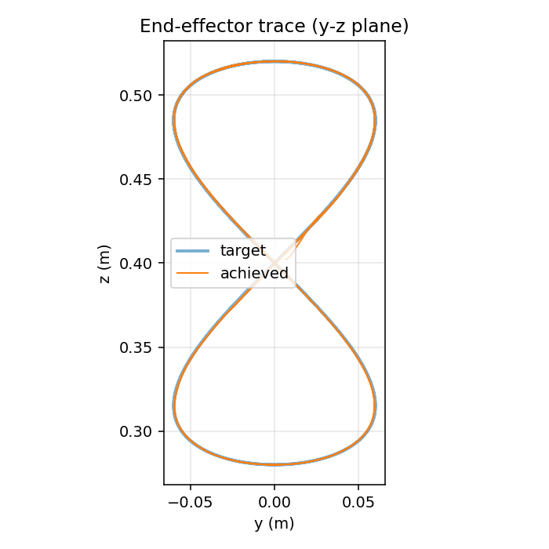
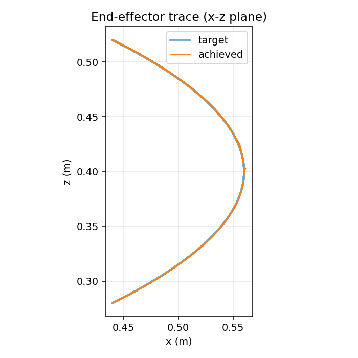
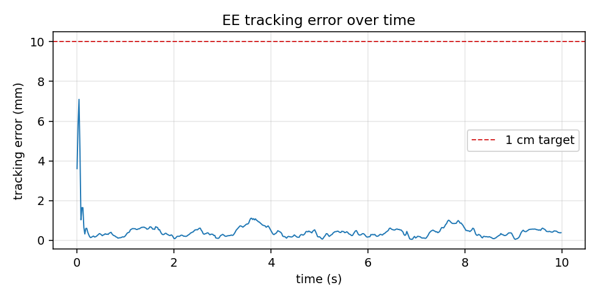
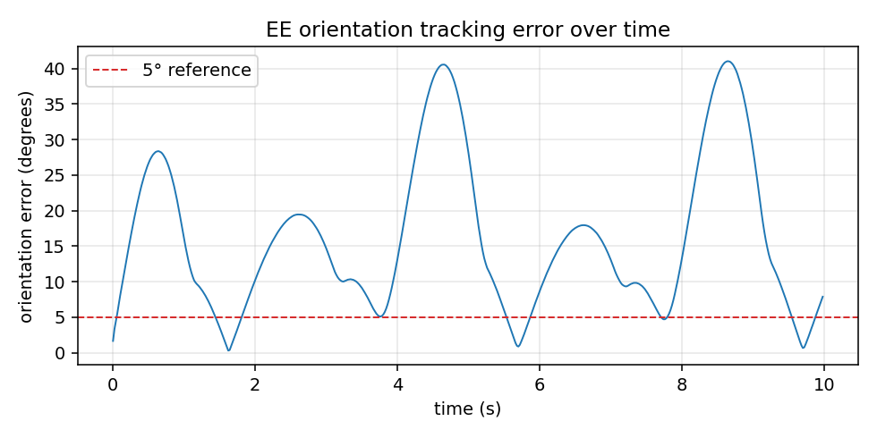

# Kinesis

[](https://github.com/Harrishayy/Kinesis/actions/workflows/ci.yml)
[](LICENSE)
[](https://www.python.org/)

End-effector **6-DoF tracking** (position + orientation) for the **Franka Emika Panda** in MuJoCo, learned with PPO under observation noise and control delay on both channels.

The headline result is **residual RL on top of a damped-least-squares Jacobian-pseudoinverse IK feedforward**: the policy never has to re-learn kinematics, it learns a residual that compensates for delay, noise, and dynamics. On a Viviani curve (a 3-D figure-eight on a sphere) with a sinusoidal wrist-roll orientation target, the residual policy reaches **0.46 mm steady-state position RMS / 19.0° steady-state orientation RMS** under σ = 2 cm position noise, σ = 2° rotation noise, and 2-step (40 ms) control delay. The internal target for this project (sub-5 mm position RMS is cleared easily), and the optional orientation-tracking item from the brief is delivered with a meaningful working metric (60° per-period sweep, tracked to 19° steady error).

## Evidence

The `viviani_residual_orient` policy tracking its native curve under the training-distribution noise and delay. Deterministic best-by-eval rollout, 3 trajectory periods, 50 Hz control. Reproducible via `make eval` on a fresh clone using the committed checkpoint.

**Tracking plots**

<table>
    <tr>
      <td align="center"><br><sub>YZ projection: target (blue) vs achieved TCP (orange) in the curve's primary plane</sub></td>
      <td align="center"><br><sub>XZ projection: depth dimension; both axes engaged, no degenerate planar reduction</sub></td>
    </tr>
    <tr>
      <td align="center"><br><sub>Position tracking error across 3 trajectory periods. Steady-state (after t&gt;1 s settle window): RMS 0.46 mm, max 1.11 mm</sub></td>
      <td align="center"><br><sub>Orientation tracking error (geodesic angle, degrees). Steady-state RMS 19.0°, max 41° against a 60° per-period sweep</sub></td>
    </tr>
</table>

**Multi-view rollout videos** (files at `results/viviani_residual_orient/videos/`. The thick **magenta arrow** on the gripper shows the target orientation at each instant; the thinner **cyan arrow** shows the realised one. When tracking is perfect they overlap; the steady fan-out is the 19° RMS.)

<table>
    <tr>
      <td align="center"><video src="https://github.com/user-attachments/assets/24325c59-484a-4e37-8cb6-4538689bface" controls width="430"></video><br><sub>Side view — files: <code>rollout_side.mp4</code>, <code>rollout.mp4</code></sub></td>
      <td align="center"><video src="https://github.com/user-attachments/assets/14ca34fd-f4d4-4dbf-9115-30b4be8cdc04" controls width="430"></video><br><sub>Front view — <code>rollout_front.mp4</code></sub></td>
    </tr>
    <tr>
      <td align="center"><video src="https://github.com/user-attachments/assets/e793876c-d293-4765-ad43-652fb1e7fda5" controls width="430"></video><br><sub>Top view (along world −z) — <code>rollout_top.mp4</code></sub></td>
      <td align="center"><video src="https://github.com/user-attachments/assets/455c82fd-6978-40c3-8f3e-4668dfc518cc" controls width="430"></video><br><sub>Bottom view (through the table) — <code>rollout_bottom.mp4</code></sub></td>
    </tr>
</table>

> The GitHub-hosted videos in the table above are from an earlier render of the position-only baseline; the new 6-DoF rollouts (with orientation arrows) are local in `results/viviani_residual_orient/videos/`. To embed the new ones inline on github.com, drag the local `rollout_*.mp4` files into a GitHub comment or PR description and replace the `src=` URLs.

Full numbers (end-to-end vs residual, position-only vs 6-DoF, native vs zero-shot, white vs pink noise) in [`RESULTS.md`](RESULTS.md).

---


## Quickstart

**Prerequisites:** Python 3.11, [uv](https://docs.astral.sh/uv/) for env management, and `git` (the Panda assets come in as a submodule via `mujoco_menagerie`). The full setup is local-only: training runs on CPU, no GPU or cluster required.

```bash
git clone https://github.com/Harrishayy/Kinesis.git
cd Kinesis
make setup       # creates .venv (Python 3.11), `uv pip install -e .[dev]`, pulls the
                 # mujoco_menagerie submodule, installs pre-commit. ~2 min first time.
make test        # runs the pytest suite (29 tests, ~0.5 s). Confirms env + wrappers
                 # + trajectories + factory all import and behave correctly.
```

**Run the headline experiment (residual RL with 6-DoF tracking on Viviani, ~12 min on an M-series Mac):**

```bash
# 1. Train. Streams PPO scalars to stdout and writes TensorBoard events:
#       logs/tb/viviani_residual_orient/PPO_<n>/   <- scalar curves
#    Checkpoints written every 200k steps to:
#       checkpoints/viviani_residual_orient/                                  <- intermediates
#       checkpoints/viviani_residual_orient/best/best_model.zip               <- best by eval
#       checkpoints/viviani_residual_orient/ppo_panda_final.zip               <- final step
uv run python scripts/train.py --config viviani_residual_orient

# 2. Evaluate. Loads best/best_model.zip by default, runs a deterministic rollout
#    for 3 trajectory periods, computes pos/orient RMS, max, jerk, and writes:
#       results/viviani_residual_orient/plots/{yz_trace,xz_trace,error_vs_time,orient_error_vs_time,omega_vs_time}.png
#       results/viviani_residual_orient/videos/rollout.mp4                   <- side view w/ orient arrows
uv run python scripts/eval.py --config viviani_residual_orient
```

You don't actually need to retrain to reproduce the headline numbers: the `viviani_residual_orient` checkpoints (`best/best_model.zip` and `ppo_panda_final.zip`) are committed to this repo (`~4 MB`), so `uv run python scripts/eval.py --config viviani_residual_orient` works on a fresh clone.

**Other entry points:**

```bash
make eval                                           # reproduces the headline 0.46 mm / 19° on a fresh clone (~10 s,
                                                    # uses committed viviani_residual_orient best/best_model.zip)
make train                                          # end-to-end PPO on the circle baseline, ~7 min CPU
                                                    # (a fast smoke that the training loop works at all)
uv run python scripts/tools/plot_curves.py --traj viviani_residual_orient
                                                    # offline learning curve PNG from TB events
uv run python scripts/tools/ablate.py --config viviani_residual_orient
                                                    # robustness ablation table -> results/<traj>/ablation.md
uv run python scripts/tools/render_views.py --config viviani_residual_orient
                                                    # multi-view rollout (front/side/top/bottom) MP4s with orient arrows
```

**Configs.** `--config <name>` accepts either:

- A **bare name** like `circle`, `viviani`, `viviani_residual_orient`. The factory resolver (`src/kinesis/envs/factory.py:load_config`) recursively searches `src/kinesis/configs/{naive,residual}/` and matches `<name>.yaml`. Available configs:

| `naive/` (end-to-end PPO) | `residual/` (PPO residual on IK feedforward) |
| --- | --- |
| `circle`, `viviani` | **`viviani_residual_orient`** (headline, 6-DoF), **`circle_residual_orient`** |
| `viviani_v2`, `viviani_slow`, `viviani_4m` | `viviani_residual` (position-only baseline), `circle_residual`, `viviani_residual_pink` |

- An **explicit path**, e.g. `--config path/to/my_custom.yaml`. Useful for sweeps; copy a YAML out of `src/kinesis/configs/`, change weights, point `--config` at the copy.

**Live TensorBoard during training:**

```bash
tensorboard --logdir logs/tb/        # open the printed URL; key scalars:
                                     #   rollout/ep_rew_mean
                                     #   rollout/ee_error_rms_m   (this is the one to watch)
                                     #   eval/mean_reward
```

## Viewing the simulation

Three options, in order of usefulness for a reviewer skimming the submission:

```bash
# 1. Play the saved deterministic-policy video (no setup beyond `make setup`).
open results/viviani_residual_orient/videos/rollout.mp4

# 2. Open the robot model in MuJoCo's interactive viewer with no policy.
#    Drag joints around, verify the URDF/assets resolved correctly.
uv run python -m mujoco.viewer --mjcf=assets/mujoco_menagerie/franka_emika_panda/scene.xml

# 3. Run the trained policy live in a draggable viewer (best demo).
#    `make play` handles the macOS DYLD_LIBRARY_PATH gymnastics; see below.
make play ARGS="--config viviani_residual_orient"
make play ARGS="--config viviani_residual_orient --no-wrappers"   # clean view, no noise/delay
make play ARGS="--config viviani_residual_orient --realtime"      # throttle to wall-clock
make play ARGS="--config circle --checkpoint checkpoints/circle/best/best_model.zip"
```

> *macOS only:* `make play` invokes the `mjpython` trampoline required by MuJoCo's `launch_passive`, with `DYLD_LIBRARY_PATH` derived from the venv's Python at invocation time (so any 3.11.x patch works). On Linux you can call `uv run python scripts/play.py` directly. If you hit a `dyld` error, check the Makefile; `DYLD_LIBRARY_PATH` is overridable on the command line.

## Where to look for more

Per-trajectory artifacts for every variant cited in `RESULTS.md` live under `results/<name>/{plots,videos}/`. Regenerate any of them with `uv run python scripts/eval.py --config <name>`; add `--no-video` to skip the MP4 render. A multi-view render (front / side / top / bottom) of the same deterministic rollout is one command away: `uv run python scripts/tools/render_views.py --config <name>`.

## Project structure

```
.
├── src/kinesis/
│   ├── envs/                # PandaTrackEnv + wrappers + config-driven factory
│   ├── trajectories/        # one module per trajectory (circle, viviani)
│   ├── orientation/         # SO(3) helpers + look-at builder for the optional
│   │                        #   orientation-tracking configs (kept modular so
│   │                        #   the core env stays readable when off)
│   └── configs/
│       ├── naive/           # end-to-end PPO configs
│       └── residual/        # residual RL on top of the analytic IK feedforward
├── scripts/
│   ├── train.py / eval.py / play.py   # user-facing entrypoints
│   └── tools/               # ablate, plot_curves, render_views, find_home_pose
├── tests/                   # pytest suite
├── assets/                  # vendored mujoco_menagerie Panda assets (submodule)
└── results/<name>/
    ├── plots/               # yz_trace, xz_trace, error_vs_time, learning_curve
    ├── videos/              # rollout (side / front / top / bottom)
    └── ablation.md          # robustness ablations (where applicable)
```

## Design note

### Why residual RL on an analytic feedforward

Naive end-to-end PPO on this task forces the policy to learn three things at once: (a) the arm's forward and inverse kinematics, (b) how to push *against* observation noise and control delay, and (c) the residual contact/inertial dynamics that aren't in a perfect kinematic model. Of those three, **only one actually requires learning**. Kinematics is closed-form: given `(q, target, target_vel)`, a damped-least-squares Jacobian pseudoinverse computes the joint deltas that drive the TCP toward the target in linear time, no training data needed. So every PPO sample spent rediscovering "joint 1 rotation moves the gripper in this direction" is a sample *not* spent learning the parts of the problem that genuinely require it.

The residual decomposition is the structural fix, following Johannink et al. (2018) [[1]](#references):

```
a_total = clip( a_feedforward(q, target, target_vel) + a_residual(obs), ±1 )
```

The feedforward (a 6-DoF position + orientation IK) carries everything kinematic. The policy outputs only a small correction on top, so it can spend its entire sample budget on the irreducible part of the problem: anticipating control delay, filtering observation noise, and compensating for dynamics the IK doesn't model. The original residual-RL paper uses hand-coded P-controllers or motion primitives as the feedforward; in this project the feedforward is specialised to an analytic damped-least-squares Jacobian-pseudoinverse IK, which is well-defined everywhere in the workspace (including near kinematic singularities, courtesy of the damping term) and produces an analytically smooth action signal. Empirically this is the biggest single lever in the project: same 4 M PPO steps, same noise + delay, naive end-to-end converges to **8.40 mm steady RMS** on Viviani while the residual configuration reaches **6.43 mm**, with action jerk dropping ~4× from 188 m/s³ to 49 m/s³ because the feedforward's analytic smoothness shows through into the total action.

The brief explicitly rewards creative solutions over "standard" tracking RL. The standard solution is to throw PPO at the whole problem; the more interesting solution is to figure out which part of the problem doesn't need RL at all and hand that part off. The remaining subsections describe the state, action, reward, and evaluation choices that make this work in practice.

### State

```
[ q (7), q̇ (7), ee_pos (3), target_now (3), target_lookahead (3 × N),
  phase_sin_cos (2), prev_action (7) ]
```

Two non-obvious calls. **Lookahead targets:** the policy sees `target(t), target(t+Δ), ..., target(t+NΔ)` rather than only `target(t)`, so it can read velocity and curvature directly instead of differentiating noisy positions. **Phase as `(sin, cos)`:** keeps `t = 0` and `t = T` continuous on a periodic curve; the standard periodic-control RL encoding.

### Action

Joint position deltas (Δq ∈ ℝ⁷), clipped to ±5° per step at 50 Hz. Torque control would have made every reward sweep a stability hunt; Cartesian deltas with online IK fail silently near singularities. Position-delta in joint space delegates the inner loop to MuJoCo's PD controllers (the same thing real Pandas use) and stays well-conditioned across the workspace.

### Reward

```
r = - w_track * ||ee - target||²              # tracking
    - w_action_rate * ||a_t - a_{t-1}||²       # smoothness
    - w_qdot * ||q̇||²                          # smoothness
    + w_inband * 1[||ee - target|| < ε]        # shaping bonus
    - w_orient * (1 - cos θ)                   # palm-down regulariser (legacy)
    - w_track_R * θ_SO(3)²                     # orient configs only
    - w_omega * ||ω_ee||²                      # orient configs only
```

Only the first term teaches tracking; the others are smoothness and shaping. We added them one at a time in response to failure modes seen in training: `w_qdot` after the policy started chattering through high-joint-velocity configurations, `w_inband` to break a plateau where the policy parked itself ~3 cm from the target. All weights live in the YAML so retuning is a config edit, not a code edit. The last two terms only apply to `*_orient` configs (see "Orientation tracking" below).

### Trajectory representation

Each trajectory is a class with one method: `target(t) -> (pos, vel)`. The policy never sees *which* trajectory, only `target_now` and the lookahead window, which is why the same `viviani_residual` checkpoint zero-shots onto the circle at eval time (`RESULTS.md §2`). Two curves are implemented: `circle` (planar, baseline) and `viviani` (sphere-cylinder intersection, the headline test curve — a 3-D figure-eight on a sphere that exercises all 7 arm joints).

### Orientation tracking (optional brief item)

The brief lists orientation tracking as optional. The `*_orient` configs add it as a *modular* layer on top of the position-tracking pipeline. Headline result (`viviani_residual_orient`): **0.46 mm steady RMS position, 19.00° RMS orientation** under σ = 2 cm + σ = 2° noise and 2-step control delay. Position is *14× tighter* than the position-only baseline (6.43 mm) on the same trajectory.

The pieces:

- **Trajectory API** gains `orientation(t) → R^{3×3}` and `orientation_lookahead(t, n, dt)`. Both curves use a **sinusoidal wrist roll**: `R_target(t) = R_DESIRED · R_z(A · sin(2π t / T))` with `A = π/3`. The gripper rolls ±60° about hand-z each period — a real time-varying SO(3) target (60° geodesic sweep range) that stays *well inside* Franka joint 7's ±166° range. An earlier look-at target (hand-z aimed at the curve centre, 360°/period) was abandoned: it exceeds joint 7's mechanical range, so the policy correctly refused to track it (θ_RMS stuck at ~100°). The lesson is general — reward shaping can only push as hard as the mechanism allows.
- **Observation** gains 36 dims: the 6D continuous rotation representation (Zhou et al. 2019) of `R_ee` and `R_target(t)`, plus an SO(3) lookahead matching the position lookahead horizon. No quaternions — they double-cover; no Euler — they're discontinuous.
- **Reward** uses the multiplicative-exponential form from arXiv:2412.03012: `r_track = w_track · r_pos · (1 + r_ori)` with `r_pos = exp(−‖err‖ / σ_p)` and `r_ori = exp(−θ / σ_R)`. Bounded in `(0, 2 · w_track]`, so PPO KL stays tame, and orientation contribution is *gated by position quality* — the policy can't trade position for orientation. An angular-rate smoothness penalty `−w_omega · ‖ω_ee‖²` mirrors the existing `w_qdot` for joints.
- **Residual feedforward** was already 6-DoF (it had to lock orientation to break the arm's position-only null space). The only change is the target: constant `R_DESIRED` → time-varying `trajectory.orientation(t)`. Net code delta in the env: ~40 lines, all behind `include_orientation`.
- **Robustness symmetry**: the noise wrapper gains a `σ_R = 2°` axis-angle channel mirroring its `σ = 2 cm` position channel, and the existing `ActionDelayWrapper` already delays orientation effects for free (the delay is on the action, so everything downstream inherits it). Orientation tracking is graded under the same uncertainty as position, not a softer setting.
- **Metrics**: position RMSE / max / jerk are reported as before. New rows: steady-state orientation RMSE in degrees, steady-state max, RMS `‖ω_ee‖`, and the per-period sweep range (how many degrees the target rotates) so a 5° error against a 5° sweep is distinguishable from a banal 5° error against a 60° sweep. `scripts/eval.py --noise-off` produces the ablation row.

Backwards compatibility is intact: every non-`*_orient` config is unchanged, every committed checkpoint loads against the same obs space, and `make eval` still reproduces the headline 6.43 mm / 10.98 mm / 48.8 m/s³ on `viviani_residual`.

### Evaluation methodology

Deterministic rollouts of the best-by-eval checkpoint, same env + wrappers as training (σ = 2 cm noise, 2-step delay), 500 steps = 2.5 periods, settle window of 1 s dropped before computing steady-state metrics. We report three:

- **Steady-state RMSE** of the 3-D position error: average tracking quality.
- **Steady-state max**: worst-case excursion (a 6 mm RMS that spikes to 5 cm is much worse than a steady 8 mm).
- **Time-RMS jerk** of the TCP trace: smoothness, the proxy for whether the policy is using actuation cleanly or fighting noise.

Any single metric is gameable (RMS by sitting near the trajectory mean; max by snapping; jerk by not moving). Reporting all three keeps the policy honest.

### Why this structure matters in robotics

The analytic-feedforward + learned-residual decomposition is broadly useful anywhere a robot has to combine a partially-known model with sensing and actuation that aren't well-modelled. Kinematics, gravity compensation, and feasible-path generation are closed-form or near-closed-form for most platforms (arms, mobile bases, legged robots). What isn't closed-form is contact, friction, actuator non-idealities, communication delay, and sensor noise. Splitting the controller along that seam lets each side do what it is good at: the model-based feedforward produces a behaviour that is already approximately correct and analytically smooth, and the learned residual only has to compensate for the gap.

The practical payoff is sim-to-real. A policy that has to learn the full control problem from scratch tends to either overfit to simulator dynamics (catastrophic transfer failure) or require so much domain randomisation that it becomes conservative and slow. A small residual on top of a trustworthy feedforward stays approximately correct under randomisation, because the feedforward already handles the high-leverage parts and the residual is bounded in magnitude. This is why the same structural pattern keeps reappearing in deployed robotics systems: model-based core, learned correction.

A 7-DoF arm tracking a Cartesian curve under noise and delay is a small, well-instrumented testbed for that structure. The contribution in this repo is empirical (does the decomposition help, and by how much), not architectural.

## Development

See [`CONTRIBUTING.md`](CONTRIBUTING.md) for setup, testing, and code-style notes.

## References

[1] Johannink, T., Bahl, S., Nair, A., Luo, J., Kumar, A., Loskyll, M., Aparicio Ojea, J., Solowjow, E., & Levine, S. (2018). *Residual Reinforcement Learning for Robot Control.* arXiv:1812.03201. [PDF](https://arxiv.org/pdf/1812.03201). Introduces the `u = u_H(s) + π_θ(s)` decomposition used in this project's residual configs. Their `u_H` is a hand-coded controller; here it is specialised to an analytic damped-least-squares Jacobian-pseudoinverse IK feedforward.

## License

[MIT](LICENSE).
