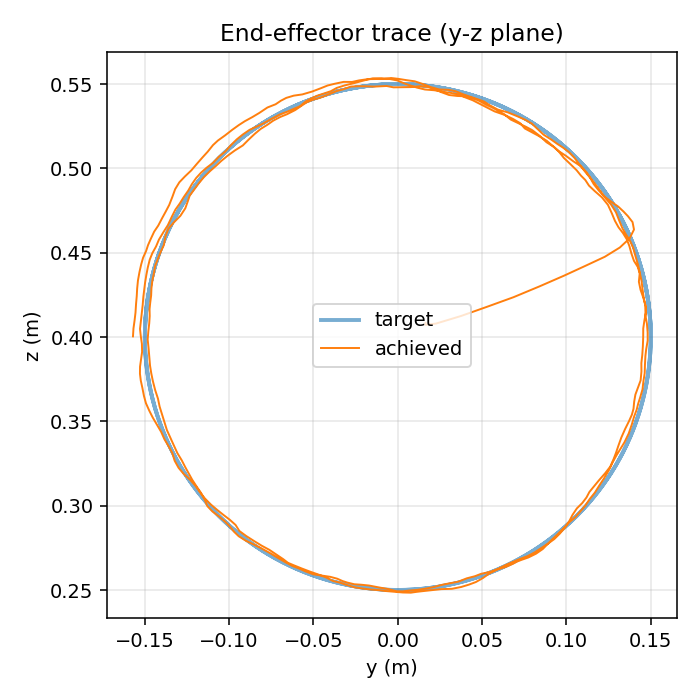
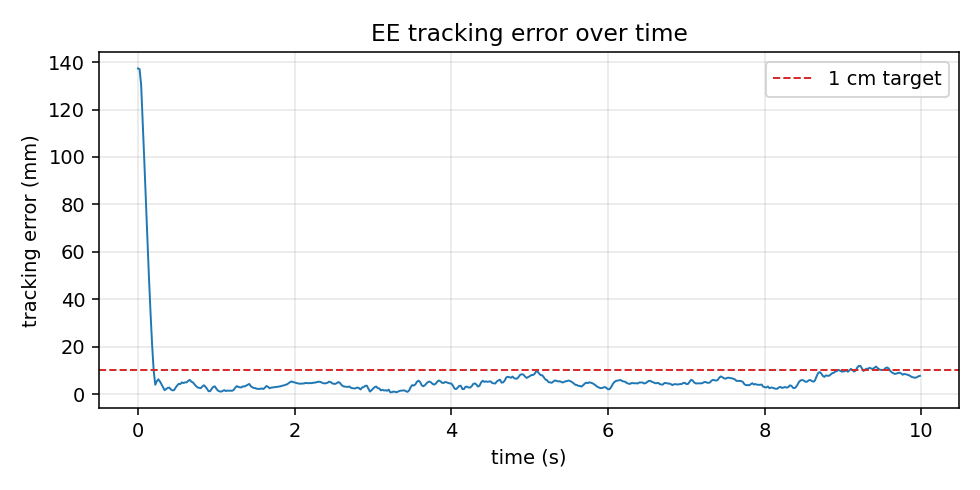

# Kinesis

[](https://github.com/Harrishayy/Kinesis/actions/workflows/ci.yml)
[](LICENSE)
[](https://www.python.org/)

Reinforcement-learning end-effector trajectory tracking for the **Franka Emika Panda** in MuJoCo. PPO policies follow a smooth Cartesian reference under observation noise and control delay. Two trajectories are supported:

- **`circle`** — 15 cm planar circle in the y-z plane at 0.25 Hz (mostly elbow + wrist).
- **`figure8_3d`** — tilted Lissajous figure-eight that spans all three axes, forcing shoulder/base joints to participate as well.

<p align="center">
  
  
</p>

**Circle result:** 5.5 mm steady-state RMS, 11.9 mm max — well under the 1 cm target — at 0.25 Hz on a 15 cm circle, under ±2 cm observation noise and 2-step control delay. Trained in ~7 min on a MacBook Pro M5 Pro (CPU).

See [`docs/circle/learning.md`](docs/circle/learning.md) for a long-form walkthrough of every design decision (MuJoCo basics, RL fundamentals, the env, the reward, the failure modes). See [`results/circle/ablation.md`](results/circle/ablation.md) for the robustness ablation.

---

## Quickstart

```bash
git clone https://github.com/Harrishayy/Kinesis.git
cd Kinesis
make setup           # uv venv + editable install + pre-commit
make test            # run the test suite (should print 18 passed)
make smoke           # 200-step SubprocVecEnv throughput check
make train           # PPO on the circle trajectory, 2M steps
make eval            # plots + MP4 to results/circle/, prints RMS/max/jerk

# 3D figure-eight (engages all 7 joints, harder than the circle):
make train-fig8
make eval-fig8
```

Every script accepts `--config <name>` where `<name>` resolves to `src/kinesis/configs/<name>.yaml` (e.g. `circle`, `figure8_3d`). Outputs land under `logs/tb/<traj>/`, `checkpoints/<traj>/`, `results/plots/<traj>/`, and `results/videos/<traj>/`.

Open `logs/tb/<traj>/` in TensorBoard to watch training curves
(`rollout/ee_error_rms_m`, `eval/mean_reward`), or generate the offline curve PNG:

```bash
uv run python scripts/plot_curves.py --traj circle    # → results/plots/circle/learning_curve.png
uv run python scripts/ablate.py --config circle       # → results/circle/ablation.md
```

## Viewing the simulation

Three ways, increasing in usefulness:

```bash
# 1. Play the saved deterministic-policy video
open results/videos/circle/rollout.mp4   # or results/videos/figure8_3d/rollout.mp4

# 2. Open the robot in MuJoCo's interactive viewer (no policy)
uv run python -m mujoco.viewer --mjcf=assets/mujoco_menagerie/franka_emika_panda/scene.xml

# 3. Run the trained policy live in a draggable window  ← best
source .venv/bin/activate
DYLD_LIBRARY_PATH=~/.local/share/uv/python/cpython-3.11.15-macos-aarch64-none/lib \
  mjpython scripts/play.py
```

> **macOS note:** `launch_passive` requires `mjpython` on macOS. `mjpython` in turn needs
> to dlopen the Python shared library, but uv's standalone Python puts the dylib in a
> non-standard location. Setting `DYLD_LIBRARY_PATH` as shown above fixes this. The
> `make play` target does this automatically.

`scripts/play.py` accepts `--checkpoint` to point at a different model, `--no-wrappers` for a clean (noise/delay-free) view, and `--realtime` to throttle to wall-clock.

## Project structure

```
.
├── src/kinesis/
│   ├── envs/           # PandaTrackEnv + wrappers + config-driven factory
│   ├── trajectories/   # one module per trajectory (circle, figure8_3d, …)
│   └── configs/        # one YAML per trajectory
├── tests/              # pytest suite
├── scripts/            # public entrypoints — all accept --config <traj>
├── assets/             # vendored mujoco_menagerie Panda assets
├── docs/<traj>/        # design notes per trajectory
└── results/
    ├── plots/<traj>/   # learning curve, trace, error vs time
    ├── videos/<traj>/  # rendered rollout
    └── <traj>/         # ablation tables, etc.
```

## Design

- **Simulator:** MuJoCo (open-source Python bindings).
- **Robot:** Franka Emika Panda from `mujoco_menagerie`.
- **RL:** stable-baselines3 PPO, 16-worker `SubprocVecEnv`.
- **Action space:** joint position deltas (∆q), clipped to a safe per-step range.
- **Observation:** joint state, end-effector position, current + lookahead trajectory targets, phase variable, previous action.
- **Reward:** weighted L2 tracking error + action-rate and joint-velocity smoothness penalties.
- **Uncertainty:** observation noise + control delay (both, configurable).

Full design notes live in [`docs/design.md`](docs/design.md).

## Development

See [`CONTRIBUTING.md`](CONTRIBUTING.md) for setup, testing, and code-style notes.

## License

[MIT](LICENSE).
