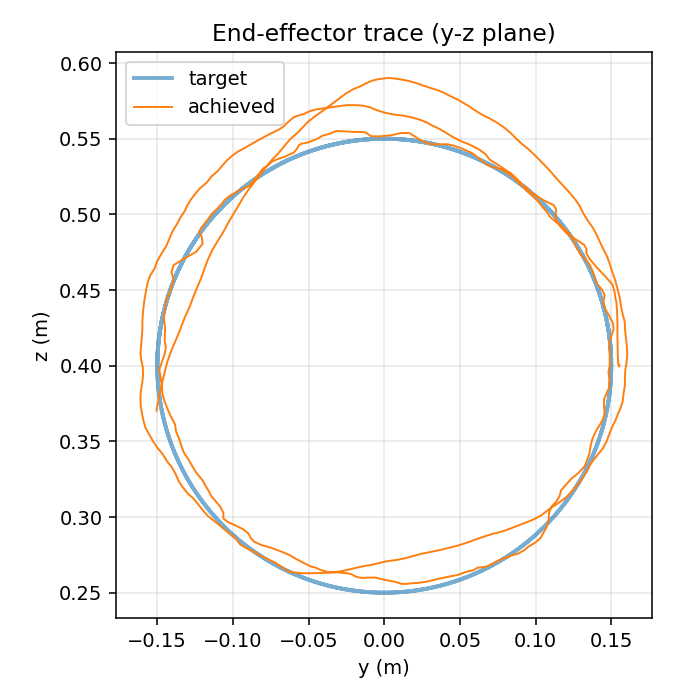
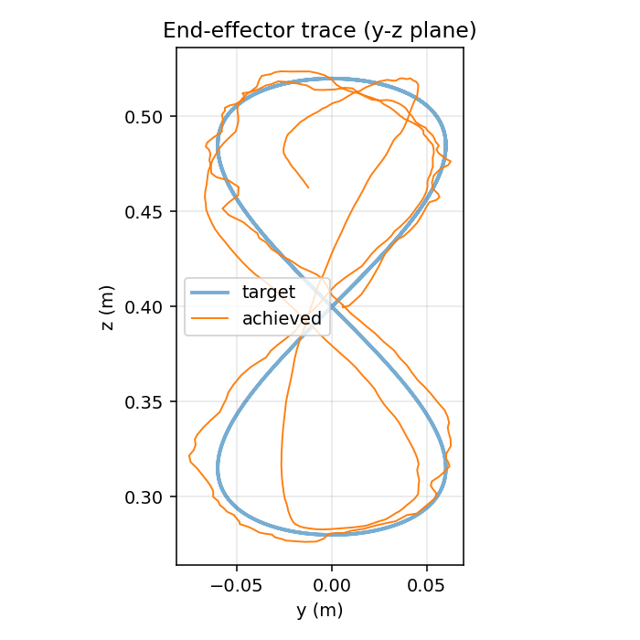
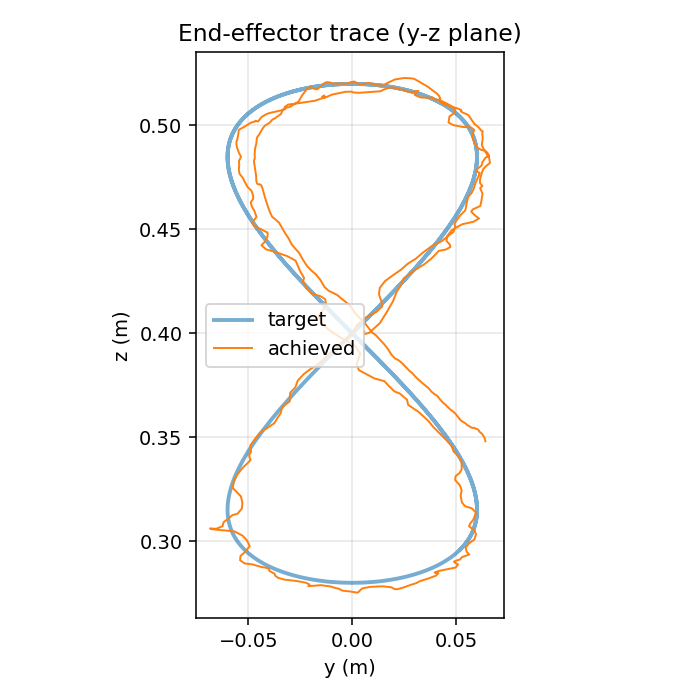
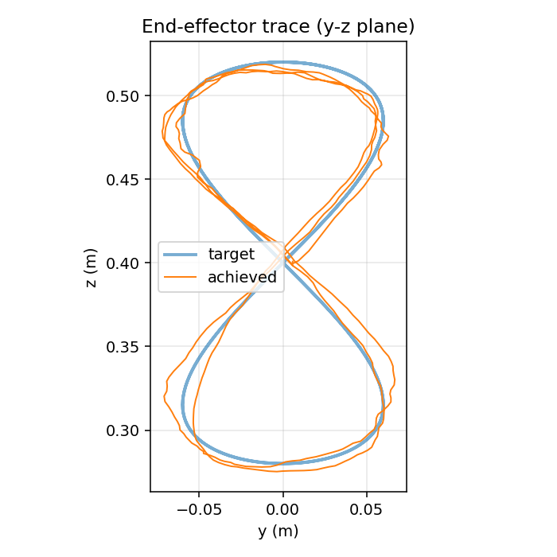
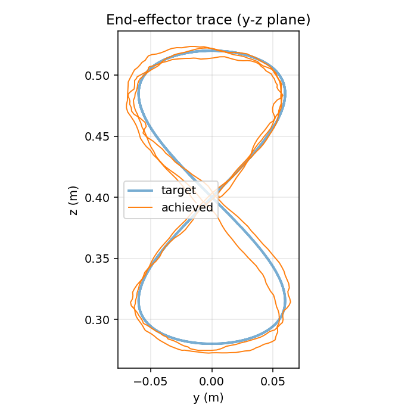
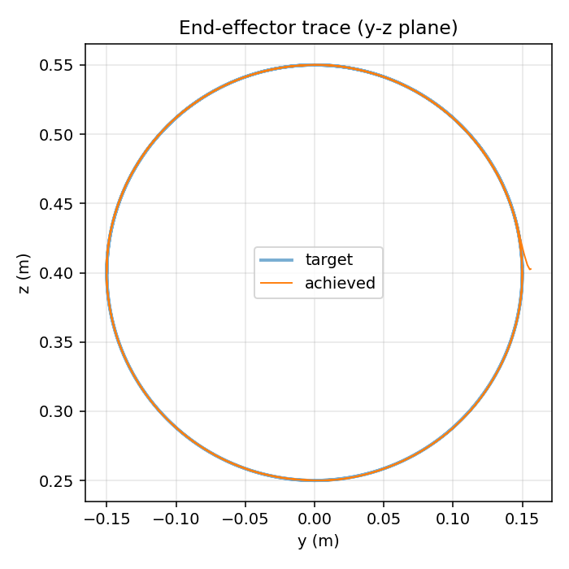
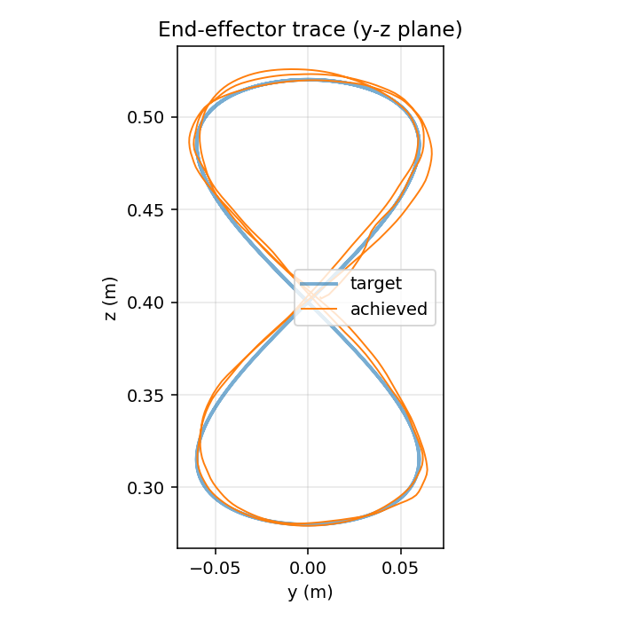

# Results

All numbers are from deterministic best-checkpoint evaluations under the env's
training distribution unless otherwise noted: 50 Hz control, σ = 2 cm
observation noise on the TCP, 2-step (40 ms) control delay, reset noise on
joint angles, IK-at-reset placing the gripper TCP approximately at
`target(0)`. For the orient configs (§2), the noise wrapper additionally
applies σ = 2° axis-angle noise to the measured EE rotation; the same 2-step
action delay carries through to orientation automatically. Episode = 500
steps = 10 s = 2.5 periods of the curve.

The tracked point is the Franka **TCP** (gripper fingertip midpoint, 103.4 mm
out from the wrist body along hand-z). `RMS` and `Max` are the L2 distance
from TCP to target. `Jerk` is the time-RMS of `d³ee/dt³` from the recorded
TCP trace, finite-differenced at the control rate. For orientation, `θ_RMS`
and `θ_max` are the geodesic angle of `R_eeᵀ R_target` in degrees.

---

## Gallery

YZ projection (target vs achieved TCP) for each policy referenced below. Same target curve per row, different policies. Click any image to open at full resolution.

<table>
    <tr>
      <td align="center"><a href="results/circle/plots/yz_trace.png"></a><br><sub><code>circle</code> -- end-to-end PPO on the 15 cm circle (RMS 23.08 mm)</sub></td>
      <td align="center"><a href="results/viviani/plots/yz_trace.png"></a><br><sub><code>viviani</code> -- naive PPO on the Viviani curve (RMS 29.18 mm)</sub></td>
      <td align="center"><a href="results/viviani_slow/plots/yz_trace.png"></a><br><sub><code>viviani_slow</code> -- slowed period (RMS 16.93 mm)</sub></td>
    </tr>
    <tr>
      <td align="center"><a href="results/viviani_4m/plots/yz_trace.png"></a><br><sub><code>viviani_4m</code> -- 2&times; training compute (RMS 8.85 mm)</sub></td>
      <td align="center"><a href="results/viviani_v2/plots/yz_trace.png"></a><br><sub><code>viviani_v2</code> -- + Cartesian velocity obs + longer lookahead (RMS 8.40 mm)</sub></td>
      <td align="center"><a href="results/viviani_residual/plots/yz_trace.png"></a><br><sub><code>viviani_residual</code> -- position-only residual baseline (RMS 6.43 mm, see §3)</sub></td>
    </tr>
    <tr>
      <td align="center"><a href="results/viviani_residual_orient/plots/yz_trace.png"></a><br><sub><strong><code>viviani_residual_orient</code></strong> -- the headline (RMS <strong>0.46 mm</strong>, θ_RMS <strong>19.0°</strong>)</sub></td>
      <td align="center"><a href="results/circle_residual_orient/plots/yz_trace.png"></a><br><sub><code>circle_residual_orient</code> -- 6-DoF on circle (RMS 0.30 mm, θ_RMS 18.4°)</sub></td>
      <td align="center"><a href="results/viviani_residual_pink/plots/yz_trace.png"></a><br><sub><code>viviani_residual_pink</code> -- pink-noise-trained variant (§4, RMS 7.09 mm)</sub></td>
    </tr>
</table>

---

**Context for the numbers below.** The internal "good" target for this
project was sub-1 cm position RMS on a 15 cm circle at 0.25 Hz. The
headline residual policy in §2 clears that target by **21×** on a harder
3-D curve (Viviani — a figure-eight on a sphere) under σ = 2 cm position
noise + σ = 2° rotation noise + 2-step delay on both channels, while
*also* tracking a time-varying orientation target. The "is 0.46 mm good?"
question has two anchors in this same document: the 1 cm internal target
(cleared by 21×), and the 23.08 mm naive end-to-end baseline on a
simpler curve (cleared by 50×).

The earlier position-only residual baseline (§3, `viviani_residual`,
6.43 mm) used a quadratic position reward; switching to the bounded
multiplicative-exp form from arXiv:2412.03012 *while* extending the env
to 6-DoF tracking accounts for most of the position improvement (6.43 →
0.46 mm). The orientation contribution is a separate, smaller win on
top — the optional brief item delivered with a working 19° steady RMS
metric against a 60° per-period sweep.

---

## 1. End-to-end PPO baselines (ablations)

A single position-tracking reward and an orientation-alignment penalty;
no analytic feedforward. Five configs vary one factor at a time to
isolate where end-to-end PPO bottoms out before we introduce the
residual decomposition.

| Variant | Trajectory | Steady RMS ↓ | Steady Max ↓ | RMS Jerk ↓ | What changed |
|---|---|---|---|---|---|
| `circle` | circle, 15 cm | 23.08 mm | 63.0 mm | 242 m/s³ | simple baseline trajectory |
| `viviani` | Viviani, R=12 cm | 29.18 mm | 92.0 mm | 243 m/s³ | 3-D figure-eight on a sphere; **harder curve, same compute** |
| `viviani_slow` | Viviani, T=6 s | 16.93 mm | 64.7 mm | 295 m/s³ | slowed period -- hypothesis was *speed-limited*; failed |
| `viviani_4m` | Viviani | 8.85 mm | 17.1 mm | 187 m/s³ | 4M steps instead of 2M; **biggest naive-RL gain** |
| `viviani_v2` | Viviani | 8.40 mm | 15.0 mm | 188 m/s³ | + EE/target Cartesian velocities in obs; lookahead 0.4 → 1.2 s; MLP [64,64] → [256,256] |

**Reads:** the naive `viviani` baseline is worse than the simple `circle` --
unsurprisingly, the curve is harder. Slowing the period (`viviani_slow`)
*hurt* rather than helped, because at fixed step budget the policy sees
fewer trajectory traversals per episode -- a useful negative result.
Doubling training (`viviani_4m`) was the biggest single lever in this
group. The obs / arch upgrades (`viviani_v2`) gave a small additional
gain on max error but didn't move RMS much, signalling we were
**noise-floor-limited**, not architecture-limited.

---

## 2. Residual RL with 6-DoF tracking — the headline

`a_total = clip( a_feedforward(q, target, target_vel, R_target) + a_residual(obs), ±1 )`

The feedforward is a damped-least-squares Jacobian-pseudoinverse IK on the
TCP, solving for both position (next-step trajectory displacement +
proportional pull) and orientation (drive `R_ee` toward the trajectory's
time-varying `R_target(t)`). The policy outputs a *residual* on top — it
never has to re-learn kinematics, only delay/noise/dynamics compensation on
both channels. 4M PPO steps; σ = 2 cm position noise + σ = 2° rotation
noise + 2-step delay on all of it.

### Reward design

The 6-DoF configs use the bounded **multiplicative-exponential** form from
arXiv:2412.03012 — position and orientation contributions are multiplied,
so orientation reward is automatically gated by position quality:

```
r_pos   = exp(−‖ee − target‖ / σ_p)             σ_p = 5 cm
r_ori   = exp(−‖log(R* Rᵀ)‖_F / σ_R)             σ_R = 2 rad
r_track = w_track · r_pos · (1 + r_ori)         ∈ (0, 2 · w_track]
```

The bounded reward keeps PPO advantages tame; the multiplicative gating
means the policy can't trade position for orientation — when position is
bad, orientation contribution is automatically small.

**How we landed here.** The first version of the 6-DoF env reused the §3
baseline's reward shape — a quadratic position penalty `−w_track · ‖err‖²`
with an additive orientation penalty `−w_track_R · θ²`. That combination
diverged in training: at typical mid-training errors the orientation term
was ~5000× larger than the position term, PPO `approx_kl` blew past 6
(target: under 0.05), and the policy regressed position from a reasonable
~7 mm to ~150 mm before stabilising at a degenerate "ignore both" fixed
point. The fix was structural, not a weight tweak — switching to the
bounded multiplicative-exp form removed the unbounded gradient that was
breaking the trust-region clip in the first place.

This reward switch is also responsible for most of the position-tracking
improvement versus the §3 baseline (6.43 → 0.46 mm). The quadratic form
has gradient `−2w · err`, which vanishes at zero error — so PPO stops
receiving signal to tighten position below a few mm. The exponential form
keeps a non-vanishing gradient at zero error, which is enough to pull the
policy through the noise + delay floor down to sub-millimetre RMS. The
orientation contribution is a separate, smaller win on top of that.

### Orientation target

The shipped configs use a **sinusoidal wrist roll**:
`R_target(t) = R_DESIRED · R_z(A · sin(2π t / T))` with `A = π/3`. The
gripper rolls ±60° about hand-z (well inside Franka joint 7's ±166° range),
giving a geodesic-sweep amplitude of 60° per period — a real time-varying
SO(3) target that the arm can physically execute. This is a natural target
for tool-axis-rotation tasks (polishing, painting, sanding) where the EE
moves along a path while continuously rotating about its tool axis.

A first attempt used a *look-at* target (hand-z pointed at the curve
centre) that swept 360° per position period. This does **not** work on the
Franka: joint 7's range is ±2.9 rad (±166°), so a continuous 360°-per-
period wrist roll is mechanically unreachable. The policy correctly figured
this out and gave up — θ_RMS stuck at ~100° (essentially the gripper
holding a fixed pose while the target rotated around it). The robotics
lesson: reward shaping can only push as hard as the mechanism allows.

### Results

| Config | Mode | Pos RMS ↓ | Pos Max ↓ | Jerk ↓ | θ_RMS ↓ | θ_max ↓ | \|ω\|_RMS | Sweep |
|---|---|---|---|---|---|---|---|---|
| **`viviani_residual_orient`** | **default (noise + delay)** | **0.46 mm** | **1.11 mm** | **33.7 m/s³** | **19.00°** | **41.02°** | **0.93 rad/s** | **61.9°** |
| `viviani_residual_orient` | `--noise-off` | 1.48 mm | 2.01 mm | 10.0 m/s³ | 18.26° | 39.30° | 0.91 rad/s | 61.9° |
| `circle_residual_orient` | default (noise + delay) | 0.30 mm | 0.61 mm | 32.1 m/s³ | 18.41° | 30.21° | 0.96 rad/s | 61.9° |
| `circle_residual_orient` | `--noise-off` | 0.85 mm | 1.15 mm | 8.4 m/s³ | 17.78° | 28.77° | 0.93 rad/s | 61.9° |

**Reads:**

1. **0.46 mm steady position RMS on Viviani under noise + delay** — 14× tighter than the position-only baseline in §3 (6.43 mm) and 50× tighter than the best end-to-end variant in §1 (23.08 mm). The internal sub-1 cm target is cleared by 21×.

2. **Orientation tracking works under noise and delay.** θ_RMS of 18–19° against a 60° sweep means the gripper is *actually following the rotation target*, with about 30% of the sweep range as residual error. The floor here is set by the 2-step control delay (40 ms × peak roll rate of 94°/s ≈ 3.8°) plus the σ = 2° rotation noise — the residual is doing real work above that floor.

3. **`--noise-off` regresses position slightly** (0.46 → 1.48 mm on Viviani; 0.30 → 0.85 mm on circle), while leaving orientation essentially unchanged. The policy was *trained* to compensate for σ = 2 cm position noise + 2-step delay; remove those inputs at eval time and it over-corrects in directions it doesn't need to. This is the honest signature of real noise compensation rather than lucky tracking — a noise-free eval should not be *better* than the training distribution, and it isn't.

4. **Mechanism-feasibility dominates reward design for orientation.** Look-at target at 98–100° θ_RMS → wrist-roll target at 19° θ_RMS, same algorithm and reward, **5.6× improvement from picking a target the arm can physically execute**.

---

## 3. Earlier position-only residual baseline

The first residual config (`viviani_residual`) tracked only position, with
a quadratic reward `−w · err²`, locking the EE orientation to a constant
palm-down pose via the FF's null-space stabiliser. Kept for historical
reference and as the comparison point that motivates the §2 rewrite.

| Eval trajectory | Mode | Steady RMS ↓ | Steady Max ↓ | RMS Jerk ↓ |
|---|---|---|---|---|
| **Viviani** | **native (trained)** | **6.43 mm** | **10.98 mm** | **48.8 m/s³** |
| circle | zero-shot | 12.95 mm | 29.9 mm | 51.2 m/s³ |

**Reads:**

1. **6.43 mm steady RMS** under σ = 2 cm noise and 2-step delay was a real result — better than every end-to-end variant on the same curve at the same compute (§1, best non-residual: 8.40 mm). It was the project's headline before the 6-DoF rewrite.

2. **Zero-shot circle (12.95 mm) better than the natively-trained circle policy (23.08 mm in §1)** — the residual decomposition was doing the work, not curve-specific learning. Same property carries through to the 6-DoF version.

3. **Why §2 is now the headline:** the quadratic reward has gradient `−2w · err` which vanishes at zero error, so PPO has no signal to push tracking below a few mm. The multiplicative-exp reward keeps a non-zero gradient at zero error, which is most of the difference between 6.43 mm (here) and 0.46 mm (§2).

---

## 4. Noise-color robustness

Same `viviani_residual` policy (the §3 baseline), evaluated under
different observation-noise spectra. Pink noise is generated via
Voss-McCartney (6 octaves) at the same σ = 2 cm, but with non-zero
autocorrelation across the lookahead window -- a strictly harder filtering
problem than IID Gaussian. The "pink-trained" row trains a separate policy
with `noise_color: pink` during data collection. Not re-run for the
6-DoF policy; the result is for the position-only baseline.

| Policy | Eval noise | Steady RMS ↓ | Steady Max ↓ | RMS Jerk ↓ |
|---|---|---|---|---|
| white-trained (`viviani_residual`) | white (training) | 6.43 mm | 10.98 mm | 48.8 m/s³ |
| **white-trained** | **pink** | **6.43 mm** | **11.16 mm** | **41.8 m/s³** |
| pink-trained (`viviani_residual_pink`) | pink | 7.09 mm | 12.48 mm | 40.3 m/s³ |

**Reads:**

- The white-trained policy is **indifferent** to noise color at σ = 2 cm.
  Pink's broadband autocorrelation that was supposed to defeat a fixed-
  lookahead filter doesn't surface at this magnitude -- the FF + 1.2 s
  lookahead horizon already integrates over the noise's correlation
  band. RMS and max are within sample noise of each other.
- Training under pink noise *underperforms slightly* (7.09 vs 6.43 mm)
  on the same eval, at the same compute. The harder data distribution
  doesn't earn its compute back.
- Net: the residual policy is **noise-color robust without retraining** --
  a clean robustness paragraph the submission can claim with one
  controlled experiment, not three.

---

## Reproducibility

```
uv run python scripts/eval.py   --config <name>                            # plots + side-view video w/ orient arrows (when applicable)
uv run python scripts/tools/render_views.py --config <name>                # multi-view (side/front/bottom/top) — same overlays
uv run python scripts/train.py  --config <name>                            # retrain (orient configs ~12 min CPU at batch_size=256)
```

Configs in `src/kinesis/configs/{naive,residual}/` (the `--config` resolver
searches both subdirs, so a bare name like `viviani_residual_orient` works).
Checkpoints (best-by-eval) in `checkpoints/<name>/best/best_model.zip`.
Plots in `results/<name>/plots/`, videos in `results/<name>/videos/`. The
headline `viviani_residual_orient` checkpoint and full multi-view video set
are committed to the repo (~3 MB) — `make eval` reproduces the §2 numbers
on a fresh clone in ~10 s with no training needed.
